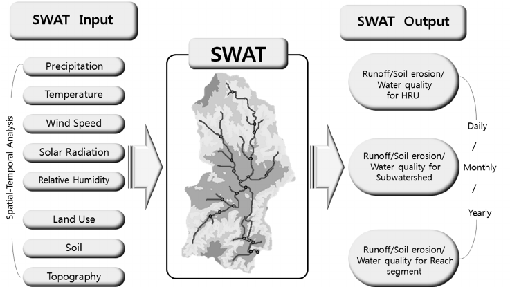
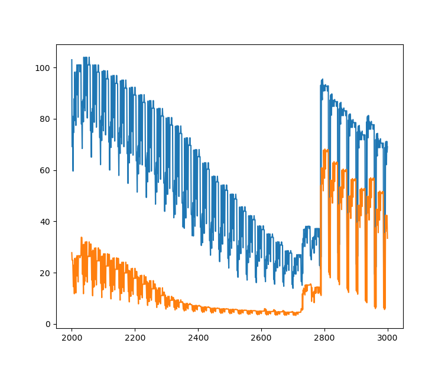
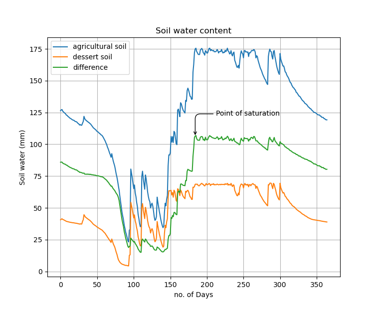

# swat_rev_module
SWAT Water analysis modelling enviornment

# Introduction
### 1. The SWAT modelling framework



- There are lot of input files for the SWAT simulation and secondary files generated during the procedure
- mainly the files are divided in to 
  1. watershed level files
  2. subbasin level files
  3. HRU level files
  4. point reservoir data files

- Each of the sub-files made using the GIS based applications
### 2. Preprocessing
- ARCGIS or QGIS may be used for preparation of input files
- The soil database should be generated   
### 3. Simulation of model

1. GUI based (ARCGIS based ARCSWAT or QGIS based QSWAT)
2. SWAT editor tool
3. command line (windows based)

- The simulation generally run in input/output folder (TxInOut folder) where all the input files are located 
- An command line program can be generated using 

### 4. post-processing

- No any good visualisation tools are availabel for SWAT output models
- Since we have already read the output files using python scripts a more better visualisation and analysing tools can be made using the scripts


### 5. Automation

- Automation of SWAT workflow is bit complicated due to:
  1. No any tutorial or documentation for the entire process
  2. A number of files are generated automatically from GIS softwares so automation either involve making such files or modifying it
  3. No any large scripting part is needed but need to generate a long list of input files
  4. There is a need of side by side runnning the simulation (both GUI and command based input preparation) to verify the procedure
  5. The SWAT modelling community is based on Windows operating systems (can be a problem when running in HPC enviornments)

### 6. Ways to implement the automation

- Got a github page where using SWAT+
  - ###### SWAT+
    - A revised model of SWAT 2012
    - last released in 2019
    - up to date
    - More organised input files
- Got some automated workflow methods and configuration tools


# SWAT Automation


- Automation part is from using the github link [SWAT+ automated worflow](https://github.com/celray/swatplus-automatic-workflow)
- For both Linux (ubuntu) and windows 
- input files shoudl be seperately given
- The above automated workflow will generate QGIS bases QSWAT project files and run the model based on the config files

## Input data 


- either The dataset or both the dataset and corres project files should be given to the input


Every other options should be given in the config file

## setting up the config files
#### Reference
[Automated worflow user manual]

## Running the simulation

1. The simulation is done using the bash script to call several python modules which will combine all the input files


## Analysis Part documentation


**importing the .sub SWAT output and reading using pandas**

```python
"""#######################
   ######SWAT-2005########
   ####SWAT-ANALYSIS######
   ####SUB and STD########"""
   
   

# importing the output files 
import pandas as pd
import os
import matplotlib.pyplot as plt
#data = "/home/nma/Downloads/output.csv"
# agricultural SWAT model output
data2 = "/home/nma/hdd/TCR/GroundWatMod/desert_sim1/Analysis/TxtInOut_agrisoil/output.sub"
##dft = pd.read_fwf(data2)
dft_agri = pd.read_fwf(data2,header=8)
# dessert output file
data3 = "/home/nma/hdd/TCR/GroundWatMod/desert_sim1/Analysis/TxtInOut_desert/output.sub"
dft_des = pd.read_fwf(data3,header=8)

plt.plot(dft_agri["SWmm"][2000:3000],label="farm soil")
plt.plot(dft_des["SWmm"][2000:3000],label="degraded")


```


**Making a seperate dataframe for anlysis**
```python
dft_a = dft_agri.iloc[:,0]
dft_d = dft_des.iloc[:,0]

bb = []
dt = []
for ii in range(len(dft_a)):
    dt += [int(dft_a[ii][20:24])]
    bb += [int(dft_a[ii][6:10])]


agri_dft = pd.DataFrame({"sub":bb,"date":dt,"perco":dft_agri['PERCmm'],"swater":dft_agri["SWmm"]})
des_dft = pd.DataFrame({"sub":bb,"date":dt,"perco":dft_des["PERCmm"],"swater":dft_des["SWmm"]})
```
**Making each day cumulative for an year**
```python
swater = []
swater_des = []
perc_agri = []
perc_des = []
""" Making dataframe for each day total"""
for ii in range(1,365+1):
    nw_dft = agri_dft[agri_dft["date"]==ii]
    swater += [np.mean(nw_dft['swater'])]
    nw_desdft = des_dft[des_dft["date"]==ii]
    swater_des += [np.mean(nw_desdft['swater'])]
    perc_des += [np.mean(nw_desdft['perco'])]
    perc_agri += [np.mean(nw_dft['perco'])]


"""Analysis of plots"""

plt.plot(swater,label="agricultural soil")
plt.plot(swater_des,label="dessert soil")
plt.plot(abs(np.array(swater)-np.array(swater_des)),label="difference")
plt.grid()
plt.legend()
#plt.axline((184, 0), (184, 106), linewidth=1, color='y')
#plt.axline((0, 106), (184, 106), linewidth=1, color='y')
plt.annotate('Point of saturation',
            xy=(184, 106), xycoords='data',
            xytext=(30, 30), textcoords='offset points',
            arrowprops=dict(arrowstyle="->",
                            connectionstyle="angle,angleA=0,angleB=90,rad=10"))

plt.title("Soil water content")
plt.xlabel("no. of Days")
plt.ylabel("Soil water (mm)")
plt.savefig("/home/nma/fig.png")
```

**An point of saturation is found out manually where the soil data matches**



**The data anlysis is automated by taking the gradient of curve and find the point after rainfall events where curves has minimum gradient**


based on the gradient 
- and point is found out 
- The output.std file is taken from SWAT ouputs
- sum of total LAT_Q and PERC (percolation) to get the groundwater contribution

```python
data_des = '/media/nma/misc/UBU20/hdd/TCR/GroundWatMod/desert_sim1/Analysis/TxtInOut_desert/output.std'
data_agri = '/media/nma/misc/UBU20/hdd/TCR/GroundWatMod/desert_sim1/Analysis/TxtInOut_agrisoil/output.std'


""" Taking the output file for the """
dft_stdagri = pd.read_fwf(data_des,engine='python',skiprows=28)[:379]
dft_stddes = pd.read_fwf(data_agri,engine='python',skiprows=28)[:379]

lat_q = pd.DataFrame({'time':dft_stdagri['TIME'][1:],'LATQ_agri':dft_stdagri['LATQ'][1:],'LATQ_des':dft_stddes['LATQ'][1:]})
#dft_stdagri = Table.read(data_des,format="latex")


times = list(lat_q['time'])
n_years = 1
year_list = np.arange(1,(n_years*12)+1)


#lat_q['time'].index.get_loc(12,method='bfill')
ddd = []
for ii in range(1,len(year_list)+1):
    print(ii)
    ddd += lat_q.index[lat_q['time'] == str(ii)].tolist()

ddd_new = np.array(ddd)[np.array(ddd) > year_list[-1]]

lat_q.drop(ddd_new,inplace=True)

perc_agri[:low_gr_ind]
perc_des[:] 
lat_q = lat_q[:low_gr_ind]
```

**from the ground water contribution the soil water content is given as canal equation input**

```python
lst_pt = lat_q[:]

water_inmm = float(input("water_per_day: "))
area = float(input("total_area: "))
#days = input("total_days: ")

water_v = ((water_inmm/1000)*area*1000000)/(24*60*60)

print("water In volume metercube "+str(water_v))

cana_depth = 3
cana_width = 10
c_cons = 1.932
## water_loss = 

length = (water_v*1000000)/(c_cons*np.sqrt(cana_depth)*cana_width)

length_of_canal = length/1000

print("length of canal: "+str(length_of_canal)+" km")


```
> visual analysis point of saturation - in 102 days
> automated analysis results saturation in 96 days


## data input files flow diagram

![]

- An seperate python based config files made using this input files

- SWAT+ is run on the windows platform in the I/O folder

> -  I have compiled and installed the SWAT in the linux system but the input files should be prepared 
> - But better way is to follow the SWAT+ automated documentation since it is already made 
> - As well as the source code is same the results should be similar


